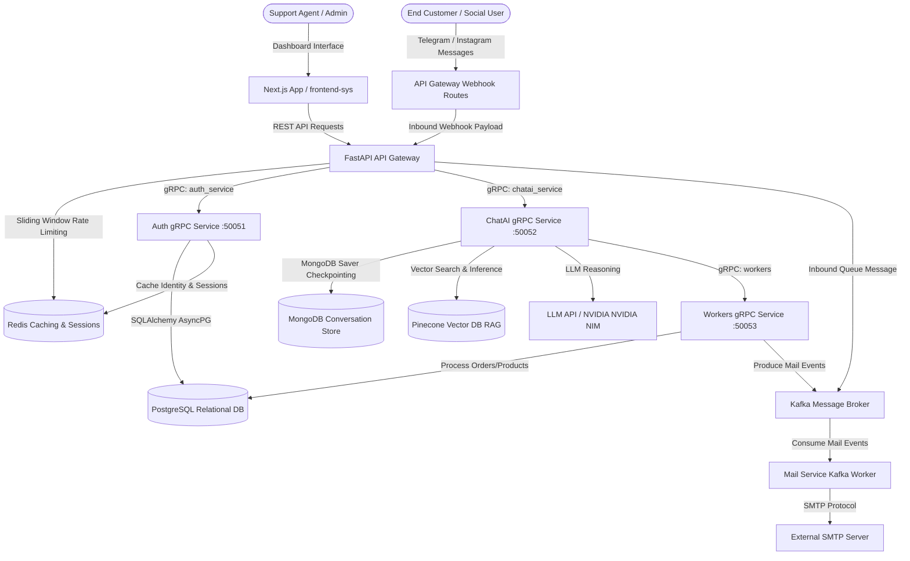

# Sahayak.ai: Unified Customer Support & Sales Agent Platform

Sahayak.ai is an enterprise-grade customer support and sales automation workspace. It integrates messaging platforms (Telegram, Instagram) with an agentic AI system to automate product catalog browsing, inventory checks, support ticketing, refunds, and order placements, while offering an interactive real-time agent dashboard for human co-piloting.

The repository is divided into two primary sub-systems:
1. **[backend-sys](file:///d:/sahayak_ai/backend-sys/README.md)**: gRPC microservices (Authentication, AI Chat agent, asynchronous task workers), a FastAPI API Gateway, and database schemas.
2. **[frontend-sys](file:///d:/sahayak_ai/frontend-sys/README.md)**: Next.js dashboard containing agent workspaces, an inbox chat manager, analytics dashboards, and public shared product details.

---

## 1. Architecture Flow



---

## 2. Environment Variables Configuration

The platform relies on configurations declared in environment files.

### 2.1 Backend Environment Setup (`backend-sys/.env`)
Create a file named `.env` in the `backend-sys` folder and populate the following keys:

| Environment Variable | Example Value / Pattern | Description |
| :--- | :--- | :--- |
| `APP_ENV` | `development` / `production` | Sets the application run mode. |
| `DATABASE_URL` | `postgresql+asyncpg://<user>:<password>@<host>:<port>/<db>` | PostgreSQL connection string using the asyncpg driver. |
| `AUTH_SERVICE_ADDR` | `localhost:50051` | Access host address for the authentication gRPC service. |
| `CHATAI_SERVICE_ADDR` | `localhost:50052` | Access host address for the AI chat agent gRPC service. |
| `WORKERS_SERVICE_ADDR` | `localhost:50053` | Access host address for the system workers gRPC service. |
| `GATEWAY_PORT` | `8000` | Port on which the FastAPI API Gateway listens. |
| `REDIS_URL` | `redis://localhost:6379/0` (or `rediss://...` for SSL) | Connection string for Redis cache, sessions, and rate-limiting. |
| `SMTP_HOST` | `smtp.gmail.com` | SMTP outgoing mail server host address. |
| `SMTP_PORT` | `587` | Connection port for TLS SMTP outgoing emails. |
| `SMTP_USER` | `no-reply@yourdomain.com` | Authentication email account username. |
| `SMTP_PASSWORD` | `your-smtp-password-or-app-pass` | Authentication email account password. |
| `MAIL_FROM` | `no-reply@sahayak.com` | Default sender address displayed on verification emails. |
| `FRONTEND_URL` | `http://localhost:3000` | The public base URL of the Next.js frontend application. |
| `BACKEND_URL` | `https://api.yourdomain.com` | The public base URL of the FastAPI API Gateway. |
| `JWT_SECRET` | `your-secure-symmetric-token-signing-key` | Secret key used for signing JWT tokens and encrypting share URLs. |
| `JWT_ALGORITHM` | `HS256` | Hash algorithm for JSON Web Tokens. |
| `ACCESS_TOKEN_EXPIRE_MINUTES`| `60` | Lifespan of access tokens in minutes. |
| `REFRESH_TOKEN_EXPIRE_DAYS` | `30` | Lifespan of refresh tokens in days. |
| `KAFKA_BOOTSTRAP_SERVERS` | `localhost:9092` | Address array for your Kafka message broker cluster. |
| `KAFKA_SECURITY_PROTOCOL` | `PLAINTEXT` | Security protocol (e.g. `PLAINTEXT` or `SASL_SSL`) for Kafka connections. |
| `MONGODB_URL` | `mongodb+srv://<user>:<password>@<cluster>/?retryWrites=true`| Connection URI for MongoDB storing chat logs and checkpoints. |
| `MONGODB_DB_NAME` | `sahayak_ai` | Target MongoDB database name. |
| `NVIDIA_API_KEY` | `nvapi-...` | API Key for LLM reasoning models. |
| `PINECONE_API_KEY` | `pcsk_...` | API Key to authenticate search index vectors in Pinecone. |
| `PINECONE_INDEX_HOST` | `https://sahayak-ai-...svc...pinecone.io` | Vector database host endpoint for RAG document queries. |
| `CLOUDINARY_CLOUD_NAME` | `your-cloudinary-cloud-name` | Cloudinary storage account cloud namespace. |
| `CLOUDINARY_API_KEY` | `your-cloudinary-api-key` | Public API key for Cloudinary asset sync. |
| `CLOUDINARY_API_SECRET` | `your-cloudinary-api-secret` | Cryptographic secret for signing Cloudinary upload payloads. |
| `INSTAGRAM_APP_ID` | `your-instagram-app-id` | Meta App identifier for Instagram webhook verification. |
| `INSTAGRAM_APP_SECRET` | `your-instagram-app-secret` | Meta App secret key for validating signature signatures. |
| `INSTAGRAM_REDIRECT_URI` | `https://api.yourdomain.com/connectors/oauth/callback/instagram`| Callback route to capture organization access tokens during OAuth. |
| `INSTAGRAM_WEBHOOK_TOKEN` | `your-webhook-verification-token` | Verification token verified by Meta Webhook setups. |

### 2.2 Frontend Environment Setup (`frontend-sys/.env.local`)
Create a file named `.env.local` in the `frontend-sys` folder and populate it with:

```env
NEXT_PUBLIC_API_URL=http://localhost:8000
```
*(Point this variable to your FastAPI Gateway endpoint—e.g. `https://api.yourdomain.com` in production environments).*

---

## 3. Local Quickstart

### Prerequisite Dependencies
Make sure you have the following services running locally:
* **PostgreSQL** (Port 5432)
* **Redis** (Port 6379)
* **Kafka** (Port 9092)
* **MongoDB**

### Running all services concurrently
The repository includes a helper script `run_services.sh` to start the frontend and all backend microservices locally using a single command:

```bash
# Set execution permissions if needed
chmod +x run_services.sh

# Run services
./run_services.sh
```

This script automatically:
1. Runs `npm run dev` in `frontend-sys/`
2. Runs the gRPC `auth_service`
3. Runs the FastAPI `api_gateway`
4. Runs the mail worker
5. Runs the gRPC `chatai-service`

---

## 4. Deployment Guide

The deployment pipeline is built around packaging microservices using Docker, uploading images to Docker Hub, and configuring an EC2 instance to run the architecture via Docker Compose.

```
Local Development                 Docker Hub                  AWS EC2 Target
+--------------------+      +--------------------+      +--------------------+
|  Build & Tag       | ===> |  Push Updated      | ===> |  SSH Pull & Compose|
|  Docker Images     |      |  Service Images    |      |  Restart Services  |
+--------------------+      +--------------------+      +--------------------+
```

### 4.1 Prerequisites
1. **Terraform**: To provision AWS infrastructure.
2. **AWS CLI**: Authenticated with credentials to manage cloud resources.
3. **Docker**: Running locally to package containers.
4. **Docker Hub Account**: Set up and logged in locally (`docker login`).

### 4.2 Step-by-Step Deployment Walkthrough

#### Step 1: Provision AWS Infrastructure
Navigate to the Terraform deployment configurations folder:
```bash
cd backend-sys/deployment
terraform init
terraform apply -auto-approve
```
This allocates an EC2 instance, configures Security Groups (opening ports `80` for Nginx, `8000` for API Gateway, `8080` for Kafka UI, and `22` for SSH), and outputs the instance's public IP address.

#### Step 2: Configure Keys and Permissions
Ensure your AWS EC2 key file `aws-key` is stored under `backend-sys/deployment/`. In WSL2/Linux environments, restrict file permissions:
```bash
chmod 600 backend-sys/deployment/aws-key
```

#### Step 3: Run the Automated Deploy Script
From the repository root, execute the deploy script. Specify the target microservice to update, or use `all` to build and redeploy the entire environment:

```bash
# Choose from: api_gateway, auth_service, chatai_service, workers, or all
./deploy.sh auth_service
```

#### What the deploy script does:
1. **Fetches EC2 Public IP**: Queries the local Terraform state to obtain the current server address dynamically.
2. **Packages the Docker Image**: Builds the target service using [backend-sys/Dockerfile](file:///d:/sahayak_ai/backend-sys/Dockerfile) (attaching the `--provenance=false` flag to avoid index format errors on containerd systems).
3. **Pushes to Registry**: Pushes the tagged image (`sugam2060/sahayak-<service>:latest`) to Docker Hub.
4. **Triggers Container Pull & Re-creation**: Copies the SSH private key safely to a temporary path, logs in to the remote EC2 instance using SSH, executes `docker compose pull`, and restarts the container service with `docker compose up -d --remove-orphans`.
5. **Verifies Status**: Prints out `docker ps` to display active containers.
