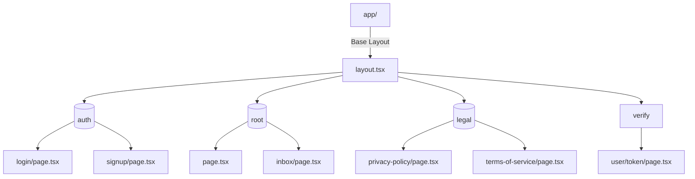

# Sahayak Frontend Service Documentation & Design Guidelines

This document describes the technical architecture, project structure, routing configurations, state management design, API communications layer, and detailed UX/UI design guidelines governing the **Sahayak** client portal dashboard.

---

## 1. Technology Stack & Dependencies

The client application is built with the following core framework configurations:

* **Framework & UI Core**: Next.js 16.2 (`package.json` v16.2.6) with React 19.2 (`package.json` v19.2.4).
* **Styling**: TailwindCSS v4 with PostCSS engine integrations.
* **Icons & Assets**: Lucide React and React Icons (`react-icons/ri`, `react-icons/fa`).
* **Forms & Validation**: React Hook Form coupled with Zod resolvers.
* **Server State Management**: TanStack React Query (`@tanstack/react-query` v5.100).
* **Client Store (Session Persistence)**: Zustand (`zustand` v5.0).
* **Alerts & Visual Feedback**: Sonner toaster providers.

---

## 2. Codebase Directory Map

The frontend uses Next.js App Router workspace directories:

```text
frontend-sys/
├── app/                  # Next.js App Router directories
│   ├── (auth)/           # Route Group: login and registration flows
│   ├── (legal)/          # Route Group: privacy and terms agreements
│   ├── (root)/           # Route Group: core dashboard, inbox, layouts
│   ├── verify/           # Verification route handling landing pages
│   ├── layout.tsx        # Base root entry layout configuration
│   └── globals.css       # Core Tailwind CSS directives and custom styling tokens
├── components/           # Functional and reusable components
│   ├── auth/             # Component elements for register and login flows
│   ├── dashboard/        # Commerce overview widgets and cards
│   ├── inbox/            # Interactive chat window, panels, and sidebars
│   ├── providers/        # Client providers (QueryProvider)
│   └── ui/               # Standard UI widgets (Buttons, Loader, Sonner, Tooltips)
├── lib/                  # Shared utilities and hooks
│   ├── api_call/         # Global API fetch methods (auth routes)
│   └── utils.ts          # Core className mergers (clsx, tailwind-merge)
├── services/             # Endpoint connection layers
│   └── api/              # Additional data API fetch wrappers
├── store/                # Clients state management
│   └── authStore.ts      # Zustand authorization persistence config
├── types/                # TypeScript interface mappings
│   └── auth.ts           # Authorization schemas
└── tsconfig.json         # TypeScript configuration definitions
```

---

## 3. Core Page Routes & Layouts (`app/`)

Sahayak segregates its pages into specialized route groups (`(...)`) to manage layouts:



### Route Descriptions

1. **`app/layout.tsx` (Global Base Layout)**:
   * Sets up document HTML schemas, sets up metadata titles, and embeds custom font configurations.
2. **`app/(auth)` (Authentication Layout Group)**:
   * **Login (`(auth)/login/page.tsx`)**: Renders login page structures, including credentials validations.
   * **Signup (`(auth)/signup/page.tsx`)**: Renders user and organization multi-step workflows.
3. **`app/(root)` (Core Dashboard Area)**:
   * Wraps pages inside shared Header and Sidebar components.
   * **Dashboard Home (`(root)/page.tsx`)**: Automatically mounts the `SalesDashboard` component via dynamic SSR-disabled imports to prevent hydration mismatches from client graphs.
   * **Inbox Workspace (`(root)/inbox/page.tsx`)**: Combines message lists, conversation windows, and customer detail cards into a unified 3-pane dashboard.
4. **`app/(legal)` (Legal Terms and Agreements)**:
   * Houses static structural frameworks formatting terms and policy templates.
5. **`app/verify/user/[token]/page.tsx` (E-mail Validation Route)**:
   * Pulls the verification token from dynamic slugs (`[token]`).
   * Triggers the API client call to confirm the verification status. If successful, redirects the user to the login screen.

---

## 4. State Management System

Sahayak utilizes two decoupled state managers.

### 4.1 Client Store: Zustand (`store/authStore.ts`)

Manages transient browser configuration, authenticated statuses, and current user models.

* **Persistence**: Uses Zustand `persist` middleware coupled with `createJSONStorage(() => localStorage)`.
* **State Structuring**:
  * `user`: Stores variables such as `user_id`, `organization_id`, `full_name`, `email`, and `organization_name` (default: `null`).
  * `isAuthenticated`: Boolean state indicating active credentials status.
  * `setAuth(data)`: Mutator updating variables and updating localStorage configurations on login success.
  * `clearAuth()`: Purges cached keys on logouts.

### 4.2 Server State: React Query (`components/providers/QueryProvider.tsx`)

Handles server-state synchronization.

* **Client Wrapper**:
  * Initializes a `QueryClient` class.
  * Wraps children in the `@tanstack/react-query` `<QueryClientProvider>` helper, exposing cached data states globally.
  * Avoids over-fetching by configuring query durations, caching states, and auto-refreshes.

---

## 5. API Communications Layer

The client application communicates with the API Gateway (port 8000) using asynchronous fetch wrappers.

### Fetch Interceptors (`lib/api_call/auth.ts`)

Functions handle JSON marshalling, default header injections, and error parsing.

* **Cross-Origin Credentials**: Fetch options include `credentials: 'include'` to ensure browser clients accept and submit the `access_token` and `refresh_token` HTTP-Only cookies managed by the backend gateway.
* **Module Exports**:
  * `loginUser(data: LoginData) -> Promise<LoginResponse>`: Transmits user credentials to `/auth/login`. Returns organization metadata on success.
  * `registerUser(data: SignupData) -> Promise<RegistrationResponse>`: Converts React Hook Form structures into database-friendly microservice schemas. Transmits payloads to `/auth/register`.
  * `verifyEmail(token: string) -> Promise<VerificationResponse>`: Hits `/auth/verify/{token}` route to finalize organization activation.
  * `logoutUser() -> Promise<{ success: boolean }>`: Triggers `/auth/logout` API, clear-cookies, and clears local Zustand stores.

---

## 6. Brand Identity & Design System

### 6.1 Colors & Semantic Tokens

Sahayak leverages curated, harmonious color palettes (avoiding raw primary colors) to deliver a premium interface. Colors adjust dynamically across light and dark themes.

| Token Type | CSS Class Name | Light Mode Value (Hex/HSL) | Dark Mode Value (Hex/HSL) | Use Case / Semantic Role |
| :--- | :--- | :--- | :--- | :--- |
| **Brand Primary** | `bg-primary` / `text-primary` | `hsl(243.4, 75.4%, 58.6%)` (Indigo) | `hsl(243.4, 75.4%, 58.6%)` (Indigo) | Active links, primary action triggers, brand indicators. |
| **Background** | `bg-zinc-50` / `bg-black` | `#F9F9FB` | `#000000` | Main application shell base layout. |
| **Surface** | `bg-white` / `bg-zinc-900` | `#FFFFFF` | `#18181B` | Navigation blocks, sidebar containers, inner cards. |
| **Subtle Border** | `border-zinc-200` | `#E4E4E7` | `#27272A` | Component partitions, card borders, dividers. |
| **Success/Live** | `text-teal-600` / `bg-teal-50` | `#0D9488` | `rgba(13, 148, 136, 0.1)` | Active state indicator pulses, solved conversations, delivered statuses. |
| **Danger** | `text-red-500` / `bg-red-500` | `#EF4444` | `#EF4444` | Invalid form warnings, notifications counters. |
| **Warning/Bot** | `text-amber-500` | `#F59E0B` | `#F59E0B` | Automated AI helper alerts. |

### 6.2 Glassmorphism Rules

Cards and floating workspaces use glassmorphic backdrops to blend UI elements:
* **Opacity Control**: Surfaces use slightly transparent fills (`bg-white/80` or `bg-white/50`).
* **Backdrop Filters**: Native CSS blur engines apply `backdrop-blur-md` or `backdrop-blur-xl` to soften background layers.
* **Reflective Borders**: Cards have thin borders (`border border-indigo-100/50` or `border-white/20`) to simulate reflective edges.

### 6.3 Shadow & Depth Maps

* **Flat Level**: `shadow-none` for borders and simple partitions.
* **Interactive Level**: `shadow-sm` transitioning to `shadow-md` on hover.
* **Elevated Overlays**: `shadow-xl` or `shadow-2xl` for dropdown menus, reply panes, and modals.

---

## 7. Typography System

The interface uses Google Fonts via Next.js configurations to structure content hierarchy:

* **Headings (`font-heading`)**:
  * **Family**: `Outfit`
  * **Application**: Header text, section summaries, stats numbers, page titles.
  * **Attributes**: High tracking weights (`tracking-tight`), heavy bolding (`font-black`, `font-bold`).
* **Body (`font-body`)**:
  * **Family**: `Inter`
  * **Application**: Chat contents, settings inputs, standard descriptions.
  * **Attributes**: Clean line-height ratios (`leading-relaxed`), medium/medium-bold weights.
* **Monospace (`font-mono`)**:
  * **Family**: Browser default `monospace` or `Fira Code`.
  * **Application**: Log timestamps, order tags.
  * **Attributes**: Strict sizing (`text-[10px]`), wide tracking (`tracking-widest`), uppercase transforms.

---

## 8. Layout Architecture & Breakpoints

* **Responsive Breakpoints**:
  * `sm` ($640px$): Switch metrics columns from single stack to dual grid.
  * `md` ($768px$): Display auxiliary sidebar panels.
  * `lg` ($1024px$): Render the 3-pane Inbox interface layout.
  * `xl` ($1280px$): Render full side-by-side growth analytics components.
* **Layout Spacers**:
  * Global application containers use standard vertical gutters (`py-8`) and page margins (`px-4`, `p-6`).

---

## 9. Main Component Layout Designs

### 9.1 Global Shell Layout (`components/Header.tsx` & `components/Sidebar.tsx`)

* **Header**:
  * Horizontal layout (`h-16`) fixed to screen tops (`sticky top-0 z-30`).
  * Structured using flex row alignments containing company logo assets, global search input stubs, notifications hubs, and user profile metadata toggles.
* **Sidebar**:
  * Collapsed navigation strip (`w-16`) positioned below headers (`h-[calc(100vh-64px)] sticky top-16`).
  * Features centered menu item icons (`lucide` and `react-icons`) enclosed within interactive `<Tooltip>` panels.
  * Incorporates active-state indicators: left-border accent bar (`absolute -left-3 w-1 h-5 bg-primary`) and primary background fill (`bg-primary text-white`).

---

### 9.2 Inbox Workspace Layout (`components/inbox/`)

The core user experience is structured as a unified 3-pane layout workspace:

```text
+---------------------+---------------------------------------+--------------------+
| Pane 1:             | Pane 2:                               | Pane 3:            |
| InboxSidebar (300px)| ChatWindow (Flex-1)                   | ContextPanel(320px)|
|                     |                                       |                    |
| - Search Bar        | - Message Thread Header               | - Tab Controls     |
| - Filter Chips      | - Chronological Conversation Bubbles  | - VIP Avatar Card  |
| - Convo List        | - Embedded Order Detail Cards         | - LTV Metric Cards |
| - Platform Badges   | - Dynamic Reply Input & AI Assist     | - Customer Story   |
+---------------------+---------------------------------------+--------------------+
```

#### Detailed Breakdown

1. **`InboxSidebar`**:
   * Uses flat surfaces (`w-[300px] border-r`) to present active chats.
   * Prominently displays platform-specific badges (Instagram logo, WhatsApp icon, Twitter icon) overlapping user avatars, alongside a status dot (Active Agent = Teal, Pending = Amber, Bot = Indigo).
2. **`ChatWindow`**:
   * Message flow displays alternating structures (Inbound: gray/white left-aligned bubbles; Outbound: light-indigo right-aligned bubbles).
   * **Embedded Order Card**: Formatted inside conversation threads as a distinct product widget showcasing thumbnail images, item prices, quantities, and quick action buttons ("View Order", "Track Shipment").
   * **Smart Reply Bar**: Positioned at the bottom of the workspace. Includes an attachments utility bar, a dynamic text-area, and an AI Auto-complete trigger button (`bg-gradient-to-br from-indigo-500 to-blue-500`) to access prompt stubs.
3. **`ContextPanel`**:
   * Tabbed interface container (`w-[320px] border-l`) organizing Customer info, Orders list, and Notes.
   * **Customer Story Timeline**: Uses vertical progress track-lines (`border-l border-indigo-100`) mapped with chronological nodes to display customer journey events (order creation, email interactions, deliveries).

---

### 9.3 Overview Dashboard (`components/dashboard/`)

* **Stats Cards**:
  * Uses 4-column layouts rendering KPIs: Total Revenue, Total Orders, Conversion Rate, Active Conversations.
  * Shows directional trend tags: upward trends display green indicators (`text-green-600 bg-green-50`), while downward trends display red indicators.
* **Channel Performance Matrix**:
  * Compact grid displaying transaction values grouped by platform channels.
  * Uses channel-specific styling (pink backgrounds for Instagram, light green for WhatsApp, and dark slate for TikTok).
* **Live Sync Pulse Indicator**:
  * Centered banner in the header showing a green dot container running `animate-pulse` animations to represent active data-sync states.

---

### 9.4 Authentication Screens (`components/auth/`)

* **Background Mesh**:
  * Custom layout using dark backgrounds overlaid with gradient mesh rings to provide a premium, modern feel.
* **Signup Flow Steps**:
  * Implements a wizard-like card step layout.
  * **Step 1: User details** - input boxes capturing Full Name, Email, and Password.
  * **Step 2: Organization details** - input boxes capturing Organization Name and customized URL organization slugs.
  * Renders stepper nodes tracking current steps visually.

---

## 10. Motion & Animations

* **Entrance Animations**:
  * Main page content loads with transition properties (`animate-in fade-in slide-in-from-bottom-4 duration-500`).
* **Micro-interactions (Scale/Rotation)**:
  * Navigation icon buttons scale up (`group-hover:scale-110`) or rotate (`group-hover:rotate-12`) on cursor hover.
  * Action buttons scale down on click (`active:scale-95`).
* **Loading Spinners**:
  * Embedded loader widgets leverage double-ring styling animations (`animate-spin border-t-indigo-600`) to represent ongoing data synchronization.

---

## 11. Public Shared Product Pages & Whitelist Routing

The platform allows external customers to view detailed product information directly from social media links via secure landing pages.

### 11.1 Dynamic Shared Product Page (`app/[org_slug]/[token]/page.tsx`)

* **Routing**: Uses the dynamic path segment `/[org_slug]/[token]` to resolve queries.
* **Component**: Uses [SharedProductDetail.tsx](file:///d:/sahayak_ai/frontend-sys/components/sharedProduct/SharedProductDetail.tsx) to display product data.
* **Functional Elements**:
  * **Uncropped Images**: Displays the full product image via `object-contain` to preserve product dimensions.
  * **Price Representation**: Formatted using native `Intl.NumberFormat` matching currency settings, avoiding decimal divisions by 100.
  * **Specifications**: Renders structured technical specifications (e.g. brand, category, dimensions) in a responsive grid.

### 11.2 Next.js Proxy Auth Bypass (`proxy.ts`)

Next.js 16+ routing handles URL pathing and redirects. To allow dynamic public shared product pages to load without prompting visitors to log in:
1. **Segment Extraction**: The proxy middleware inspects incoming path patterns.
2. **Whitelist Rule**: Paths matching the structure `/[org_slug]/[token]` (where `token` corresponds to the encrypted organization-product hash) are dynamically whitelisted.
3. **Execution**: The proxy router skips identity verification redirects for these matched segments, forwarding requests directly to the Next.js server components.

